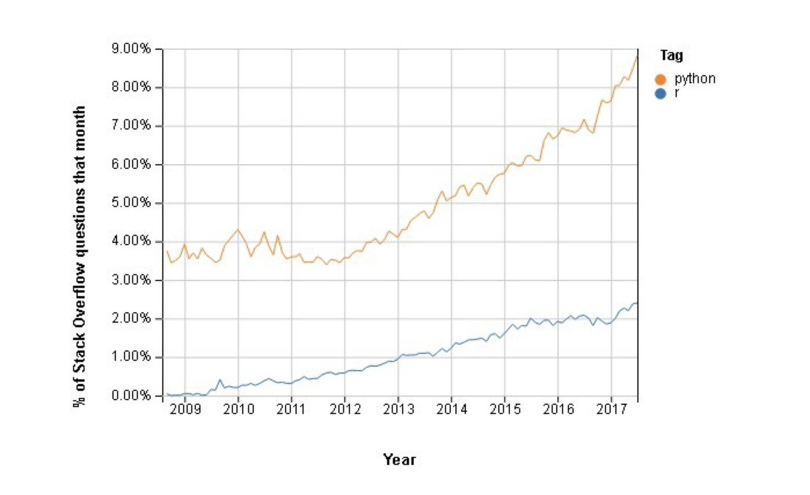

# Should you choose Python over R for visualization

## Introduction

First of all, welcome! We've been visualizing using R this semester and are in the process of transitioning to D3. These are solid visualization choices, and coming from Python, I have been pleasantly surprised. Visualization in Python has played second fiddle to R for a long time, and this class has only served to highlight how far visualization libraries such as matplotlib and seaborn need to come to match R's community-oriented, centralized, flexible, and overall, easy approach to data visualization.  
  
However, I also believe that matplotlib and seaborn, among other Python visualization tools, have their own little neat quirks to offer, even if the documentation might be (it's subjective) confusing as hell (or impossible to find) and it takes a lot more fine tuning for you to get the desired ridgeline plot or histogram. Also, according to a Stack Overflow poll, Python appears to be trending upwards in popularity vs R (though perhaps I should scale this time-series based plot to 1% first before I make that conclusion...):  
  
  
  
Whatever the case, Python is a main player in the data science realm, and thus, you should expect to have to learn matplotlib and seaborn. I'm here to help you get started! Hopefully you find this tutorial as exciting as I did making it. Let's get started!

## Disclaimers

First of all, I wanted to lay out some things you should know before you read:
* Yes, I know there might be a more efficient way to do it in Python. Keep in mind that this is a tutorial about visualization, not optimization.
* Yes, I know there might be a neat little lambda function, list comprehension, etc. I could have substituted. Not everyone knows Python very well yet; this is for beginners and thus I wanted to keep this as simple as I could possibly make it (plaese [comment](#comment) if anything did confuse you though)
* There is more than one way to visualize in Python, even within the realms of matplotlib and seaborn. Although I do appreciate [comment](#comment), please refrain from debating over which visualization is better

## Comments/Additions/Modifications

What I've included here is just the start. I've shared this repo (and plan to include a link to it on the EDAV page) to allow others to comment/add/modify it as a dynamic way of exchanging Python visualization tidbits with each other (like a crude version of the EDAV homepage right now). I would very much appreciate your continued input! Please feel free to add or modify as you please!  
  
One thing I do ask is to please make sure all discussions and changes are productive. Please:
* do not discuss/post off-topic issues
* do not argue/debate
* do not plagiarize (for your own benefit)
* if you have any reservations before posting anything, [email](#contact) me first to check
* do not, absolutely do not, discuss/post anything offensive

If we can all adhere to these basic rules, then I believe we can set up a great collaborative resource not only for our class, but future ones as well.

## Before You Begin

All of the Rmds should be runnable on RStudio >=1.2. Please upgrade before you begin, as you won't be able to easily interface with Python in earlier versions.
You'll need to install the reticulate library in R before you use Python. Of course, that means you'll have to install Python if you haven't already! I highly recommend installing the Anaconda distribution of Python. It comes with a great package management system and is generally very easy to use. Also, please make sure you have the most up-to-date Python version (3.7 as of 11/05/18).
  
All Rmds posted to this repo should include the following signature before writing any Python blocks:  

```
path_to_python <- "path/to/python3". 
use_python(path_to_python, required=TRUE)  
```

To find the path where Python 3 is installed, type ```which -a python3``` in your terminal, and select the one you wish to use. The path I've included in each .Rmd file may not be the path that fits you, so please be careful.  

You may also need to install certain Python libraries before running certain Markdown files. Although I have not, you may prefer to use a Python virtual environment. Please consult https://rstudio.github.io/reticulate/articles/python_packages.html to learn more.  

These lines are needed to ensure the right Python (or just any Python in general) runs with RStudio.  
  
One more thing: I've been struggling to get rpy2 to work, so for the time being I've written the respective R datasets to files, and reading from them subsequently in Python. rpy2 offers a very neat interface from R to Python. I haven't played around with it too much, and I'm not sure if it supports Python 3. If someone could get that working, that would be truly awesome!  
  
The files are located in the ```files``` directory, while the R markdown files should go in the ```markdown``` directory. Most of the examples I've used are taken directly from the EDAV website, translated to Python.  
  
You run the Markdown files as we've learned in class. Hopefully at this point you know what they are and how they work.  
  
RStudio Python blocks don't exactly work like Jupyter notebooks. For one, you actually need to call plt.show(). Also, be careful with chart formatting; be sure to call plt.clf() before each Python block!  
  
Well, that's pretty much it! As mentioned earlier, if you have any issues getting Python set up/interfacing Python with RStudio/etc., please feel free to [email](#contact) me!  

## My Conclusions

* Guido van Rossum developed Python to make programming easier. Sadly, that hasn't really translated to data science yet.
* The R community, well, feels more like a community. You can see it in the effort they put into documenting their work and their discussions.
* I believe Python suffers in part because it is not a niche programming language. R has been around much longer as a data science tool, whereas Python, despite offering very good machine learning/web scraping/NLP libraries, is much newer in the data science field. So it's community is much more youthful in that regard, whereas R's is much more experienced.
* Any other observations? Place them here!
  
## Contact

My email is alk2225@columbia.edu

## About Me

Alex Kong is a first-year data science enthusiast currently studying at Columbia University. He is struggling, just like some of you, with Algorithms, Probability and Statistics, and of course, EDAV!  